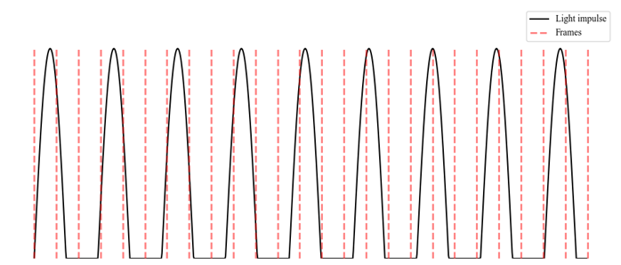
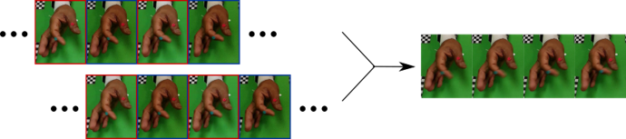
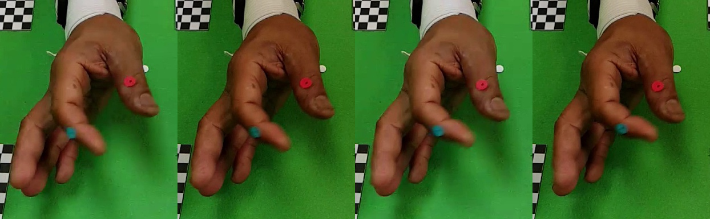
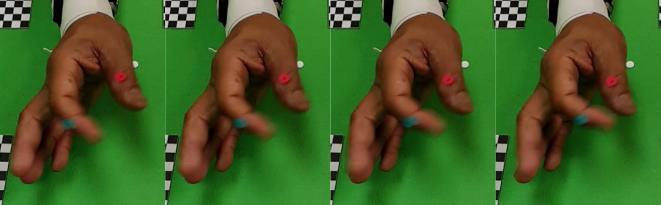

# Remove video flickering using duplicate footage
This project introduce a efficient method to remove the video flickering.

## Video flickering
Video flickering is a phenomenon that has an impact on video quality.
The flickering happens when the sampling frequency is mismatched with the artificial lighting source
* Illustrate the FPS and artificial lighting source

## How this project work
1. Copy original footage
2. Shiht the duplicate footage one frame right
3. Blending these two footage (adjust opacity)

## The flowchart of the duplicate method

## Result
* Original footage

* New footage

## Conclusion
* The duplicate method is a very simple and efficient approach to remove the video flickering
* This method will introduce blur to the footage, especially the object with high-speed movement
* If your scene is complex or contains high-speed motion, I will recommend you to try other advanced method

## Reference
* [Fix Flickering Video](https://primalvideo.com/video-creation/editing/fix-flickering-video-how-to-remove-flickering-and-strobing-in-videos/)
* [Shutter Speeds](https://www.red.com/red-101/flicker-free-video-tutorial)

